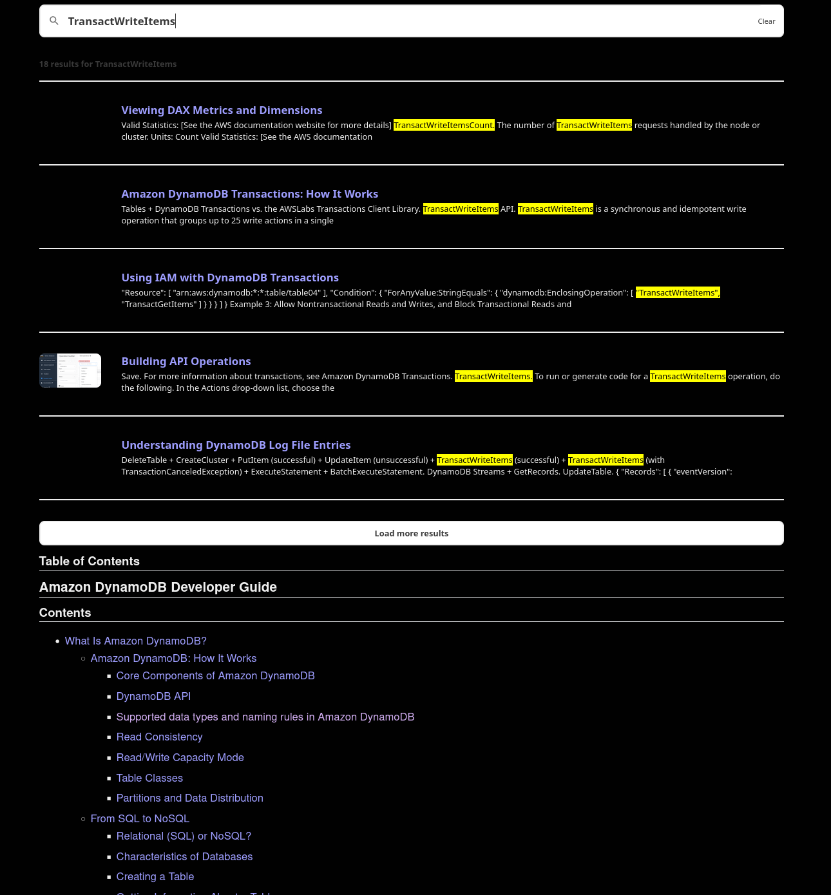

# Local AWS DynamoDB docs

Searchable dynamodb docs you can build locally. Just run `make`. You'll need `pandoc`, a version of `pandoc-sidenote` compatible with the version of pandoc you're using, and `pagefind` to build the local search index. All of these need to be on your `$PATH`. Afterwards, just run `make` in the base of this directory and you'll be able to view the dynamodb docs locally here.

